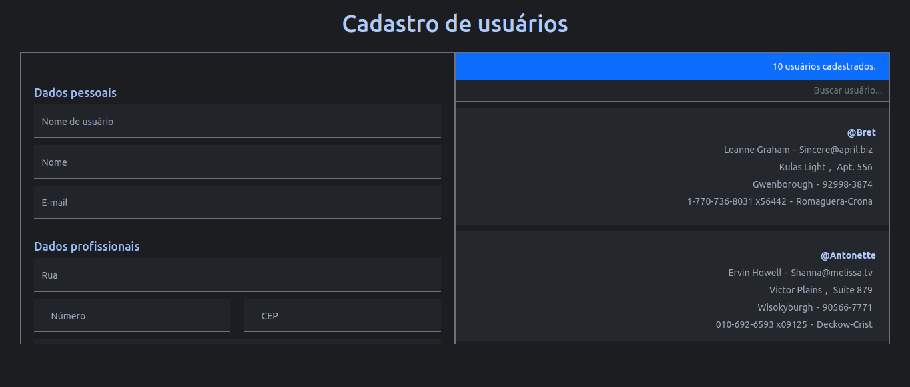
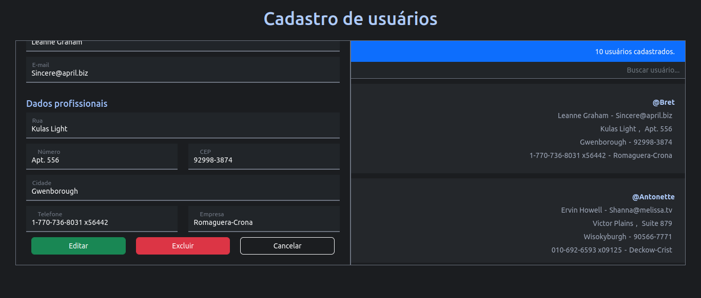

# CRUD de usuários

Esta aplicação apresenta um sistema CRUD, onde são realizadas as operações de cadastro, busca, edição e exclusão.

Utilizando a biblioteca React, componentes funcionais renderizam a interface. São usados os seguintes hooks: *useState*, *useEffect*, *useContext* e *useMemo*. Esta é uma adaptação do projeto final do [curso React Hooks](https://www.youtube.com/playlist?list=PLWXw8Gu52TRKOXf7qaBg5FEUgiW1lJyQb).

##  :gear: Tecnologias

- HTML
- CSS
- JavaScript
- ReactJS
- React Hooks
- Bootstrap

##  :art: Layout

